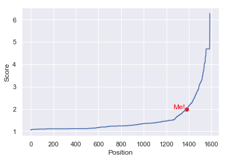

# Introduction

This python class let you scrap the leaderboard in your favourite Kaggle competition for know where you will be (theoretically). This is a web scraper that takes a score and compares you in the leaderboard (It don't make submissions for you, neither has access to secret databases, just take all the scores from the leaderboard page and interpole your position in there, just theoretically!)

# How it works

You needs to call the class Kaggle and assign it to an object, like:
```python
Kaggle_class = Kaggle()
```

Once it has started, you need to pass the url to the function *Get_scores*. This url must be the leaderboard's url, something like:
```python
Kaggle_class.Get_scores(url = 'https://www.kaggle.com/c/ashrae-energy-prediction/leaderboard')
```

Its take time, a higher leaderboard leads to a higher wait time (For example, the titanic competition takes 5-10min). If you don't have patiente, you can save a backup in your disk using the function *Save_backup_scores(filename)*, and load it using *Load_backup_scores(filename)* where *filename* is the name for your file with ".csv" extension(Note: Those scores will not be updated, its just a local backup). 
```python
Kaggle_class.Save_backup_scores(filename = 'Some_random_name.csv')
Kaggle_class.Load_backup_scores(filename = 'Some_random_name.csv')
```

Finally, you can see your possition in the leaderboard using *Represent_my_score(my_score = x)*, where x is your submit score (Once again, "theoretically").
```python
Kaggle_class.Represent_my_score(my_score = 2)
```


## All together
```python
# Class definition
Kaggle_class = Kaggle()

# Get scores
Kaggle_class.Get_scores(url = 'https://www.kaggle.com/c/ashrae-energy-prediction/leaderboard')

# Backup stuff
Kaggle_class.Save_backup_scores(filename = 'Some_random_name.csv')
Kaggle_class.Load_backup_scores(filename = 'Some_random_name.csv')

# Plots
Kaggle_class.Represent_my_score(my_score = 2)
```


# Special files
For run the webscraper you will need the Chrome driver *chromedriver.exe* available in <https://sites.google.com/a/chromium.org/chromedriver/downloads> or in this repository (Watch out with your Chrome version).

Also, you will need to define your chrome path in the *chrome_options.binary_location* inside the *Kaggle.\_\_init\_\_()* function. I setted it to my path (Chrome instalation path by default).


